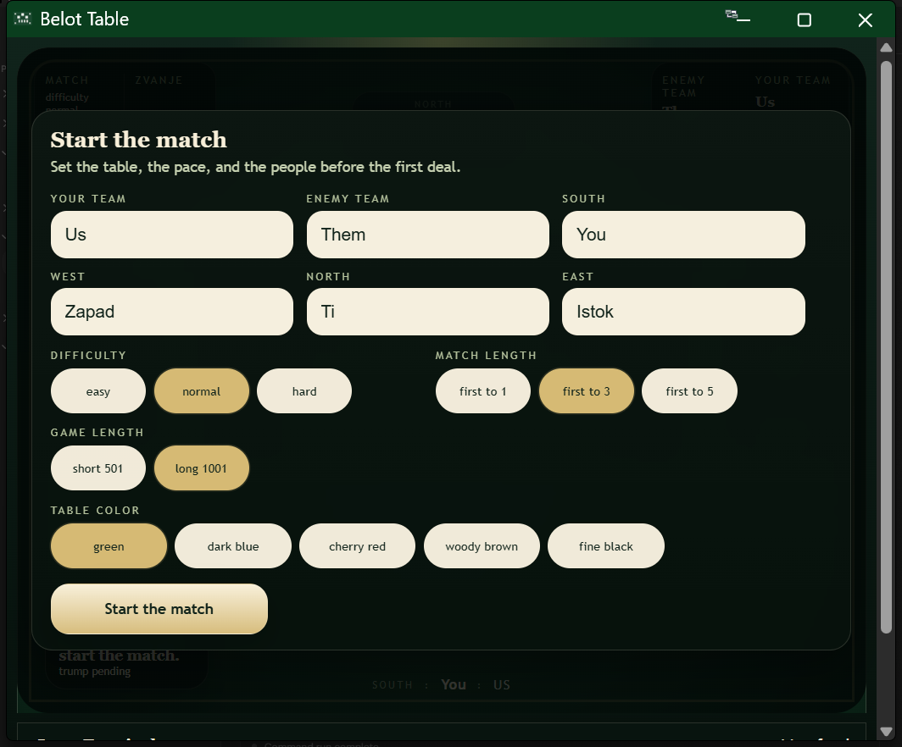

# Projekt Belot

Check out the deployed page: https://lomuss33.github.io/AdioBella/

Projekt Belot is a single-player web implementation of Belot. The project keeps the original Java engine and Spring Boot server for local full-stack development, and it also includes a browser-only GitHub Pages build so the game can be played online for free.

## What You Get

- One human player against three AI players
- A React table UI with a terminal-style event log
- Match setup before the first deal
- Difficulty selection
- Match length selection: first to 1, 3, or 5 wins
- Game length selection: short 501 or long 1001
- Table theme selection
- Free static deployment through GitHub Pages

## Live And Local Modes

There are two ways to run the project:

- GitHub Pages mode: a static browser build with local in-browser game/session handling
- Local full-stack mode: Java engine + Spring Boot API + React frontend

Use the deployed page if you just want to play:

```text
https://lomuss33.github.io/AdioBella/
```

Use the local full application if you want to develop or test the original backend-backed version.

## Tech Stack

- `engine`: Java match engine and shared game view models
- `server`: Spring Boot session API and event stream
- `webclient`: React + TypeScript frontend
- `GitHub Pages`: static deployment target for the browser-only build

## Requirements

- Java 21+
- Node.js 20+ and npm
- A shell that can run Gradle and npm

## Quick Start

Run the local full application:

```bash
./gradlew runGame
```

Then open:

```text
http://localhost:8080
```

If `8080` is already in use:

```bash
./gradlew runGame -PserverPort=28081
```

Then open:

```text
http://localhost:28081
```

For live development with frontend hot reload and backend auto-recompile/restart:

```bash
./gradlew liveGame
```

Then open:

```text
http://localhost:5173
```

If you want different ports:

```bash
./gradlew liveGame -PserverPort=28081 -PclientPort=5174
```

## Frontend Commands

Run the frontend tests:

```bash
cd webclient
npm test
```

Build the normal frontend bundle:

```bash
cd webclient
npm run build
```

Build the GitHub Pages bundle:

```bash
cd webclient
npm run build:pages
```

## Gradle Commands

Build everything:

```bash
./gradlew build
```

Run all tests:

```bash
./gradlew test
```

Run only the engine tests:

```bash
./gradlew :engine:test
```

Run only the server tests:

```bash
./gradlew :server:test
```

## GitHub Pages Deployment

The repository includes a GitHub Actions workflow that builds `webclient` and publishes the static output to GitHub Pages.

Important details:

- Pages build command: `npm run build:pages`
- Published output: `webclient/dist`
- GitHub Actions workflow: `.github/workflows/deploy-pages.yml`
- Current Pages base path: `/AdioBella/`

To redeploy:

1. Push changes to `main`.
2. Open the repository `Actions` tab.
3. Run or wait for `Deploy Belot to GitHub Pages`.
4. Open the live site after the workflow finishes successfully.

## How The Online Version Works

GitHub Pages cannot run the Spring Boot server. Because of that, the online build uses a browser runtime inside `webclient` so the game can run without backend requests. The local Gradle flow still keeps the original backend-backed application available for development.

## Project Layout

```text
engine/
  src/main/java/com/belot/engine
server/
  src/main/java/com/belot/server
webclient/
  src/
  public/
.github/
  workflows/
docs/
  screenshots/
```

## Gameplay Notes

- The first screen lets you set team names and player names
- You can choose AI difficulty before the match starts
- You can pick match length and game length before the first deal
- Trump selection appears as an in-game action overlay
- The bottom terminal log shows recent game events and prompts

## Art Assets

The current UI still uses placeholder assets for cards and suits:

- card face placeholder: `webclient/src/assets/cards/face-placeholder.svg`
- card back: `webclient/src/assets/cards/back.svg`
- suit placeholders: `webclient/src/assets/suits/*.svg`

These can be replaced later without changing the public game flow.

## Troubleshooting

### GitHub Pages Shows A Blank Screen

Make sure the GitHub Actions Pages deployment finished successfully and that the site is being served from the correct repository path:

```text
https://lomuss33.github.io/AdioBella/
```

### Port Already In Use

Check which process owns the port:

```powershell
netstat -ano | findstr :8080
```

Inspect the PID:

```powershell
Get-Process -Id <PID>
```

Stop it if needed:

```powershell
Stop-Process -Id <PID> -Force
```

Or run the app on another port with `-PserverPort=...`.

### Stale Local Session

The local full-stack frontend can store the active session id in browser storage. If a session becomes invalid, refresh the page or clear local storage for the local site.

### Frontend Build Artifacts

When you run `./gradlew runGame`, Gradle builds the frontend automatically before the server starts. You do not need to copy files manually.

## Current Limitations

- single-player only
- in-memory sessions only
- placeholder card and suit art
- no persistence between restarts

## Start Screen


