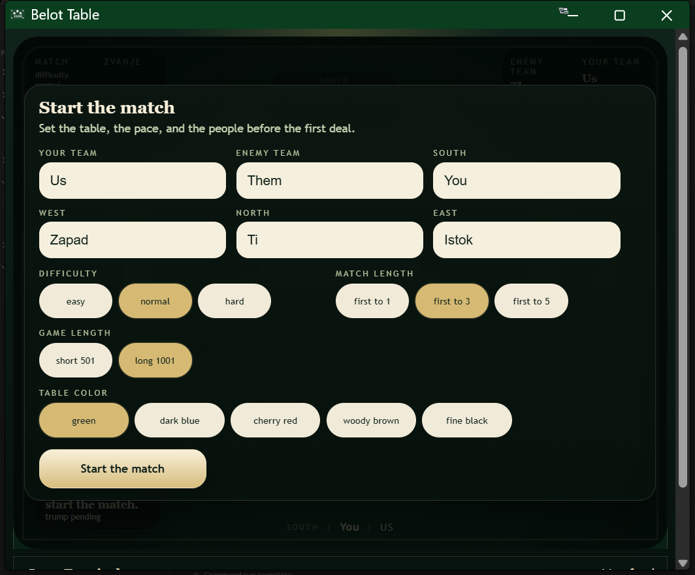

# Projekt Belot

A single-player Belot game built with React and TypeScript, with a Java engine and Spring Boot server for local play. You play with an AI teammate against two AI opponents.

[Play online](https://lomuss33.github.io/AdioBella/) · [User guide](USERGUIDE.md) · [Maintainer guide](MAINTAINER.md) · [Development docs](docs/README.md)

## Play locally

Install JDK 21 and Node.js with npm (the deployment workflow uses Node 20), then run from the repository root:

```powershell
.\gradlew.bat runGame
```

On macOS or Linux, use `./gradlew runGame`. Open <http://localhost:8080>. Gradle installs frontend dependencies and packages the UI into the server.

For hot reload, browser-only development, and custom ports, see [Development](docs/development.md).

For live UI development without Java, run from the project root:

```powershell
npm run setup
npm run dev
```

Setup is needed once after cloning or when frontend dependencies change. Open the local URL printed by Vite (normally <http://localhost:5174>). Saved UI changes update automatically. Use `npm run dev:full` for live development with the Java backend.

## Features

- English, German, and Croatian, selected from browser preferences or the starting menu.

- Team and player names, three AI difficulty levels, and table themes.
- Short (501) or long (1001) games; matches to 1, 3, or 5 game wins.
- Trump selection, meld declarations, Bela prompts, and a game event log.
- Browser-only play on GitHub Pages, or local play through the Java server.

Sessions are held in memory. Online games are lost on page reload; local server games are lost when the server restarts. Multiplayer and durable saved games are not implemented.

## Development

Human contributors: start with [Development](docs/development.md) and [Architecture](docs/architecture.md).

AI coding assistants: read [AI development guidance](docs/ai-development.md) before editing, then use the same development and validation workflow.

| Directory | Purpose |
| --- | --- |
| `engine/` | Java rules, match state, snapshots, and events |
| `server/` | Spring Boot session API, event streaming, and bundled UI |
| `webclient/` | React UI and browser game implementation |
| `scripts/` | Local development launcher |
| `docs/` | Development, architecture, API, and deployment reference |

See [LICENSE](LICENSE) for the GNU GPL v3 license text.


